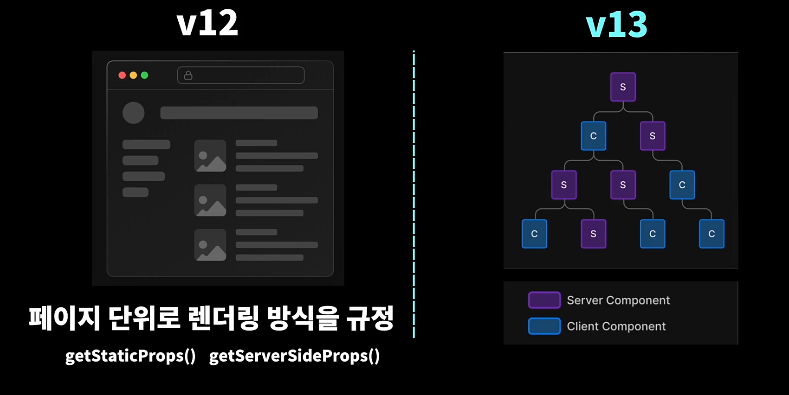

## 12ver vs 13ver

  

#### 12ver

**페이지 단위** 로 렌더링 방식을 규정

- getStaticProps() -> SSG | ISR
- getServerSideProps() -> SSR

#### 13ver

**컴포넌트 단위** 로 렌더링 방식을 규정
하나의 페이지에서 서버컴포넌트와 클라이언트컴포넌트를 적절하게 섞어서 사용할 수 있음

- Server Component(서버상에서만 동작하는 컴포넌트)
- Client Component

  
