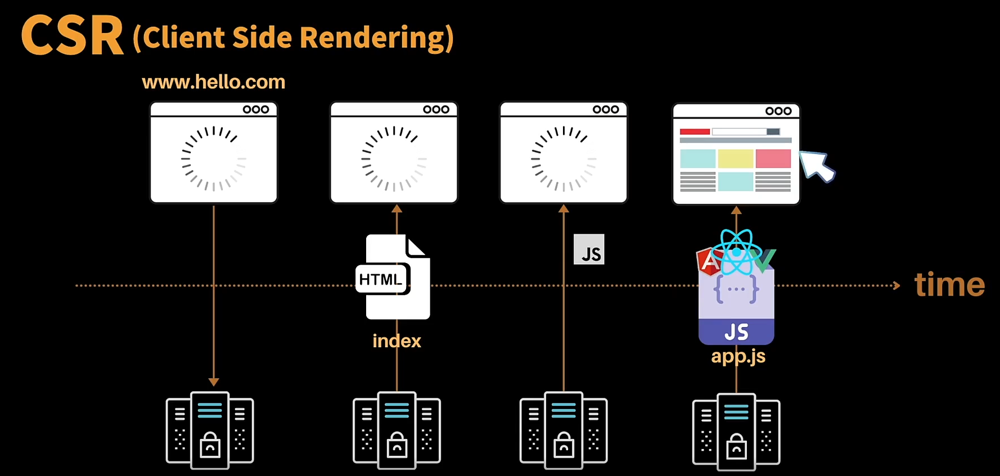
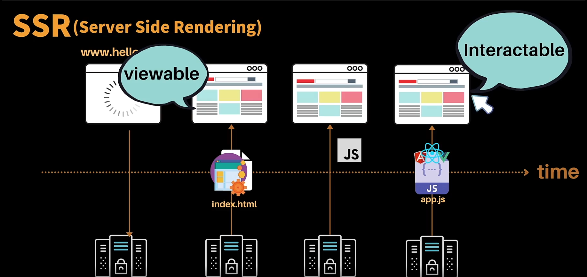
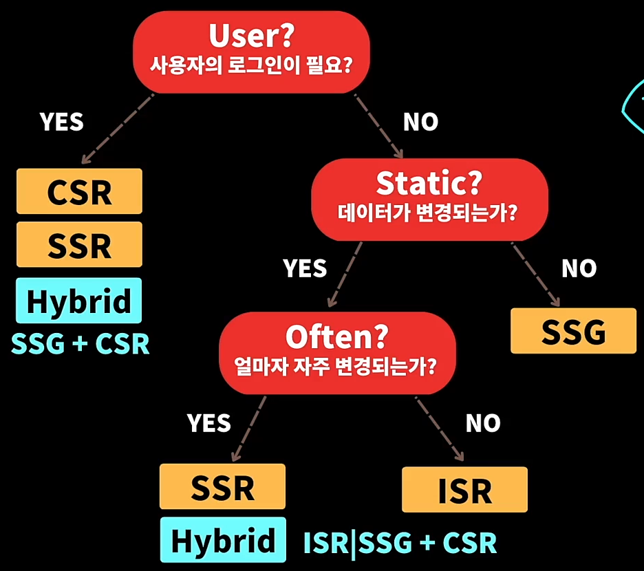

## Next.js?

- 리액트를 베이스로한 프레임워크
- 리액트로 웹앱을 개발하는데 리액트만으로는 힘든 +많은 것들을 가능하게 해줌

#### 라이브러리 vs 프레임워크

라이브러리

- 우리가 무언가를 만들때 유용한 툴
- 특정한 문제를 해결하기 위해 필요한것만 골라 쓰기(UI, State Management, Routing)
- React는 UI를 만들기 위한 라이브러리

프레임워크

- 특정한 아주 작은 단위의 문제를 해결하는게 아니라 큰 단위의 솔루션을 제공
- 큰 골격을 제공하고, 그 정해진 골격안에 우리가 원하는 로직을 구현하면됨(UI, State Management, Routing, HTTP Clients)

## Next.js의 History

- Vercel이라는 회사에서 2016년에 처음 등장
- 6가지의 원칙 기반으로 2022년에 새로나온 13버전에 유용하고 새로운 기능들이 상당히 추가됨

#### Learning Point of Next.js

- Next.js를 쓰는 이유 -> 리액트만으로 힘들기때문에 많은 것을 가능하게 해줌 그렇다면!
- 리액트의 한계점을 정리
- Next.js가 어떤것들을, 어떻게, 왜 정리

## CSR

Client Side Rendering

- 렌더링하는 주체자가 클라이언트 -> **브라우저**

#### 장점

- 한번 로딩되면, 빠른 UX제공
- 서버의 부하가 작음

#### 단점

- 페이지 로딩 시간(TTV)이 길다 = TTV(Time to view) = FCP(First Contentful Paint)
- 자바스크립트 활성화 필수임
- SEO 최적화가 힘듬
- 보안에 취약함
- CDN에 캐시가 안됨, 어려움
  - CDN(Content Delivery Network)
    - 사용자에 근접한 나라에서 데이터 가져옴

#### 정리

- 리액트라는 UI라이브러리만을 사용해 웹어플리케이션을 만들면 CSR이 발생한다.
- CSR이란 브라우저에 표기하기 위한 모든 코드들을 전부 Client측에서 전부 다운받아서 Client측에서 코드를 실행하고 분석해서 표기하는것을 말한다.
- 한번 로딩되면, 빠른 UX제공하고 서버의 부하가 적은 장점이 있다.
- 하지만 사용자가 첫 화면을 보기까지 오래 걸리고, 자바스크립트 활성화가 필수이며, SEO최적화가 힘들고, 보안에 취약, CDN에 캐시가 힘들다.
- CSR 즉, 리액트 라이브러리의 문제를 해결하기 위해 나온게 Next.js 프레임워크이다.
- Next.js를 사용하면 SSG, SSR을 사용할 수 있는데 CSR의 문제점을 보완 및 해결할 수 있다.

## SSG

Static Site Generation(정적인 사이트를 만드는것!)

- 렌더링하는 주체자 -> **서버**
- 어플리케이션을 서버에 배포해서 처음 **빌드할때 렌더링됨**
- 서버에서 렌더링이 되긴 하는데, **언제 렌더링**을 하냐에 따라서 SSR인지 SSG인지 결정됨

#### 순서 및 특징

- 우리 서버에 Nextjs 어플리케이션을 배포해서 우리 웹 어플리케이션을 실행하기 전에 먼저 빌드를함
- 빌드를 할때 서버에서 우리가 작성한 코드를 실행하면서 리액트 코드를 HTML로 렌더링(변환)함
- 코드에서 서버에있는 데이터베이스를 읽거나, 클라우드 데이터베이스에서 데이터를 읽어와서 페이지를 만든다면 이 모든것들이 빌드할때 실행
- 이 과정을 거쳐서 실제 HTML파일들을 빌드할때 만들어둠
- Client가 서버에 요청을하면 서버는 미리 만들어진 HTML을 Client에 전달함
- 그럼 Client는 HTML을 보여주기만하면됨
- HTML 파일들을 서버에서 미리 만들어놔서 HTML받아오기 때문에 다음에 사용자가 홈페이지에 접속하면 서버까지 가지 않아도, CDN에 캐시된 HTML파일을 빠르게 가져올 수 있음

#### 장점

- 페이지 로딩 시간(TTV)이 빠름 (미리 만들어둔 HTML만 받으면 되니까)
- 자바스크립트 필요 없음
- SEO최적화가 좋음
- 보안이 뛰어남
- CDN에 캐시가 됨

#### 단점

- 빌드할때 렌더링이 되기 떄문에 데이터가 정적임
- 사용자별 정보 제공의 어려움
- 데이터가 정적인, 잘 바뀌지 않은 웹사이트만 적절함

## ISR

Incremental Static Regeneration

- 렌더링하는 주체자 -> **서버**
- 설정한 주기만큼 주기적으로 **렌더링**
- 정해진 주기에 따라 페이지를 다시 생성함

#### 장점

- 페이지 로딩 시간(TTV)이 빠름 (미리 만들어둔 HTML만 받으면 되니까)
- 자바스크립트 필요 없음
- SEO최적화가 좋음
- 보안이 뛰어남
- CDN에 캐시가 됨
- **데이터가 주기적으로 업데이트됨**

#### 단점

- 실시간 데이터가 아님
- 사용자별 정보 제공의 어려움

이러한 문제점을 해결하기 위해 나온게 **SSR**

## SSR

Server Side Rendering

- 렌더링하는 주체자 -> **서버**
- 언제 렌더링 하는지? -> Clien가 요청 시 렌더링
- client가 서버에 요청 -> 서버에서 필요한 코드 실행/클라우드에서 데이터 가져오기 등 -> HTML만듦 -> client에 전달

#### 장점

- 페이지 로딩 시간(TTV)이 빠름 (미리 만들어둔 HTML만 받으면 되니까)
- 자바스크립트 필요 없음
- SEO최적화가 좋음
- 보안이 뛰어남
- **실시간 데이터를 사용 -> 항상 최신의 데이터를 반영한 HTML을 받을 수 있음**
- **사용자별 필요한 데이터 사용 가능**

#### 단점

- 비교적 느릴 수 있음(요청할때마다 서버에서 렌더링을해서 client에 보내야하기 때문에)
- 서버 과부화가 걸릴 수 있음(서버의 overhead가/과부화가 높아진다)
- CDN에 캐시가 안됨

## 결론

완벽한 렌더링 솔루션은 없다..! 상황에 따라, 웹어플리케이션에 따라 적절한 방법을 사용하면됨

## Next.js for Hybrid Web App

- 하나의 어플리케이션에서 각 페이지마다 다른 렌더링 방식을 사용할 수 있고, 하나의 페이지에서도 여러가지 렌더링 방식을 사용할 수 있음

#### Hybrid

- 혼합, 특정 **목적**을 달성하기 위해 **두개 이상(이중성)** 의 기능이나 요소를 결합
- 목적 -> 성능 좋은 강력한 Web App / 두개 이상 -> CSR, SSG, ISR, SSR
- 예를 들면, Home(ISR), About(SSG), Profile(SSR/CSR), Contact(CSR)

## Hydration for interaction

- Hydration: 수화시키다, 물로 가득 채우다
- 물 = react(예를들면, 컵라면/캔디형 물티슈는 가지고 다니기 쉽고 편하다. 이후 필요할떄 물을 채우면 사용하고 먹을 수 있다~), **리액트로 가득 채우다!**

- Pre-rendering
  Client에서 서버에 페이지를 요청을 하면, NextJS은 필요한것들 이것저것 받아와서 페이지를 생성하는데 이떄 생선된 페이지는 **정적 HTML 페이지**
- Client는 정적 HTML페이지를 먼저 빠르게 보여줄 수 있음 -> 사용자는 페이지를 볼수는 있지만, JS코드가 없기 떄문에 아무런 반응이 일어나지 않음
- 컴포넌트 렌더링
  이후 페이지에 필요한 리액트와 자바스크립트를 보내주고 Client는 다운받으면 정적인 HTML페이지에 리액트와 자바스크립트를 가득 채운다!(Hydration)

- 사용자에게 빠르게 페이지를 보여주기 위해 서버는 정적인 화면을 먼저 보내주고, 이후 리액트와 자바스크립트 코드를 보내주고 Client에서 정적인 HTML페이지 대신 실제 컴포넌트를 사용할 수 있게 컴포넌트 렌더링을 해줌

- Keypoint -> 정적인 HTML페이지와 Hydration된 다음의 **간극 최소화**

## Web App 개발 시 중요한 포인트

TTV와 TTI를 항상 신경쓰고 개발해야함

#### TTV(Time to View)

사용자가 웹사이트에 접속해서 웹사이트를 보기까지 오랜시간이 걸리지 않도록 최대한 시간을 줄여야함

#### TTI(Time to Interaction)

사용자가 브라우저를 인터랙션할 수 있는 시점

### CSR(Client Side Rendering)

  

Client에서 웹사이트에 접속하면 서버에 요청 -> 서버에서 Client에게 텅텅빈 HTML파일 전달, 사용자가 의미있는 컨텐츠를 보지못함 -> 서버가 소스코드(js,css), 라이브러리 등 모든 코드 전달 하여 Client에서 전부 다운받고 페이지 사용 가능

### SSR(Server Side Rendering)

  

Client가 웹사이트에 접속하면 서버에 요청 -> 서버가 미리 만들어놓은 정적인 HTML 전달, Client에서 다운로드 후 즉각적으로 웹사이트 볼 수 있음, 하지만 사용은 불가능 -> 서버가 소스코드(js,css), 라이브러리 등 모든 코드 전달 후 사용 가능

- 사용자가 클릭해서 처리하는데까지 시간적인 간극이 있기때문에 사용자가 볼수있는 시간과 실제로 사용할 수 있는 시간의 간극을 얼마나 줄여나가냐, 사용자에게 이 간극을 잘 알려줄 수 있는지가 핵심

# 그렇다면 언제 어떤걸 쓰면 좋을까?

User? 사용자의 로그인이 필요한가? 사용자별로 달라지는 데이터인지 아닌지 생각해보자

- YES -> 사용자 로그인이 필요하다면, 사용자별로 민감한 데이터라면 **CSR, SSR, Hybrid(SSG+CSR)**

- No -> 사용자의 로그인이 필요하지 않은, 공개적으로 모든 사용자가 동일한 데이터 -> 그 데이터가 얼마나 자주 변경이되는지, 정적인지? 주기적으로 변하는지?
  - Yes -> 사용자의 로그인은 필요하지 않지만, 데이터가 주기적으로 변경된다면, 얼마나 자주 변경되는지?
    - YES -> 데이터가 변경이될때 사용자가 즉각적으로 확인 해야한다면 **SSR**, 과부화가 걱정이라면 **Hybrid(SS|ISR+CSR)**
    - No -> **ISR**, 데이터가 자주 변경이 되지 않고, 데이터의 업데이트 사양이 아주 민감하지 않는다면(5분, 1시간, 하루 등등)
  - No -> 사용자의 로그인이 필요하지 않고, 공개적인 웹페이지, 데이터가 변경되지 않는다면? **SSG**
